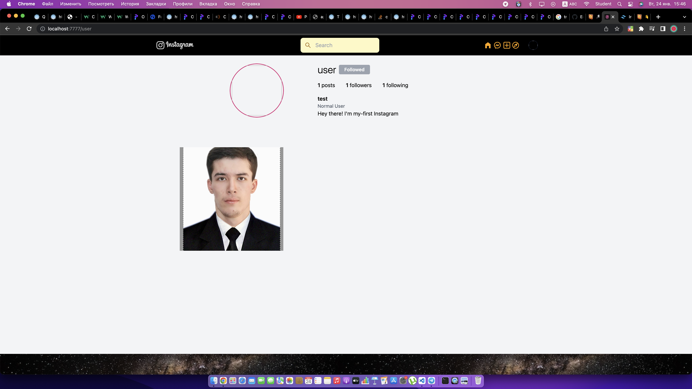
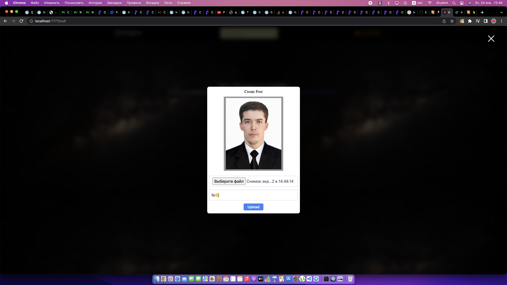

# My Project Instagram
Welcome to my project 
<a href="https://master.dp4gjrndsrj6l.amplifyapp.com/">Instagram</a>

# Demo
 <a href="https://master.dp4gjrndsrj6l.amplifyapp.com/">AWS</a>

# Abilities 

- 👤Login & Signup
- 🔒Change you password
- 📌Indicates that users exists as you type username when signing up
- 📊About, Developer, Help, 404, No such user, No such group page
- ➕Follow, Unfollow, Recommend and Profile views
- ❤️Like, Comment (Sticker and Text), Tag, Untag, Remove tag, Copy post link, Delete post, Edit post, Open post.
- 📖Post Text, Image (with filters), Video, Audio, Link, Document, Location with emojis, Font size, Tag, mentions, hashtags
- 🕰️ Time ago format used everywhere.
- 🎦 Custom Video and Audio player.
- ☑️ Add tags to describe yourself much more.
- 📂 Edit your profile (From username, Fullname or Bio, social links to tags).
- ⚙️ Get suggestions on whome to follow (you can also refresh suggestions).
- 〽️ Know what are some of the most popular hashtags.
- 🅿️ Mutual likes and comments as in Facebook (When you see a post, if your followings have liked or commented on the post, then app re-arranges post's likers and commenters in a way that your followings get the first priority).
- 📸 Shows images in Theatre mode.
- 🧑🏼‍ 🤝‍ 🧑🏻Explore people, photos, videos, audios and groups.
- 🎥 Get notified on almost everything from your post being liked, commented, shared TO you being added to a group.
- ✉️ Message emoji, Text, Image, Sticker.
- 🚮 Delete conversation, unsend all your messages, edit conversation title and get all info about the conversation.
- 📚 Bookmark the post if you liked it.
- 🔎 Add/remove members.
  <li>Edit group's settings.</li>
  <li>Change your avatar from over 200 custom avatars, don't like it upload your avatar with a cropping tool.</li>
  <li>If a text post is large, then a glimpse of the post is shown and you can load more.</li>
  <li>Search users.</li>
</ul>

